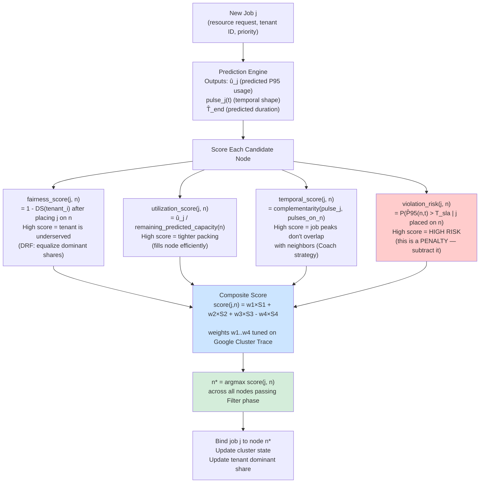
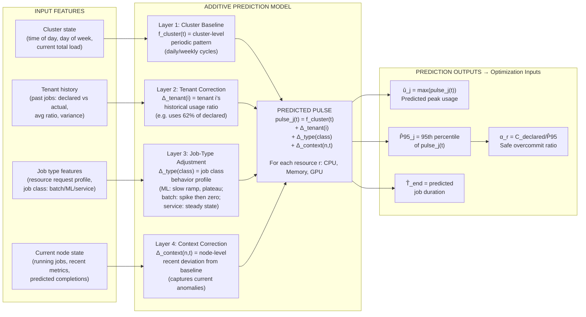
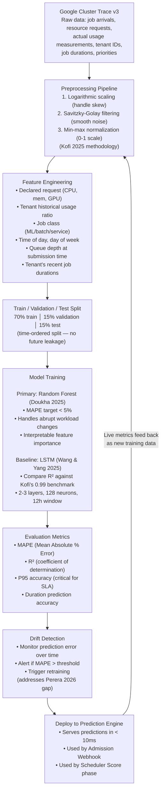
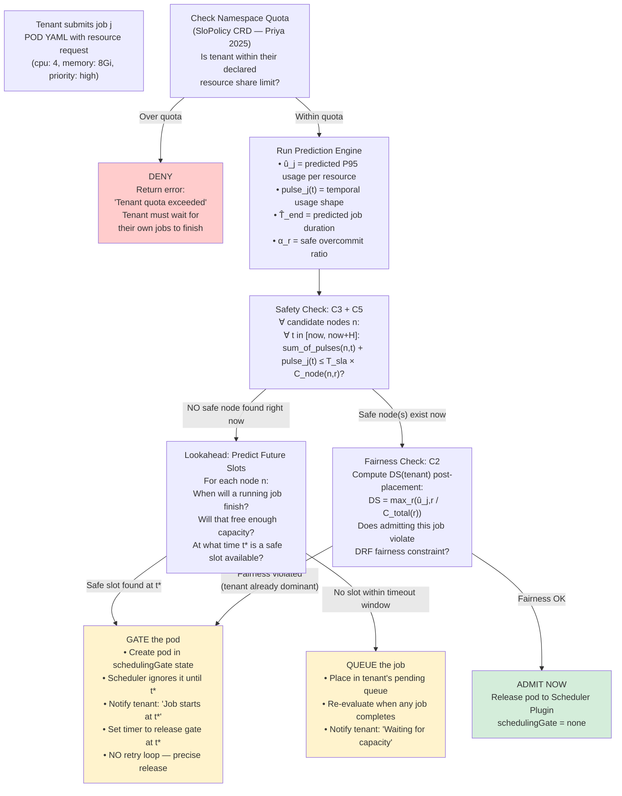
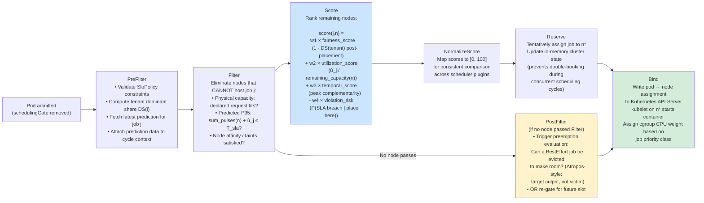
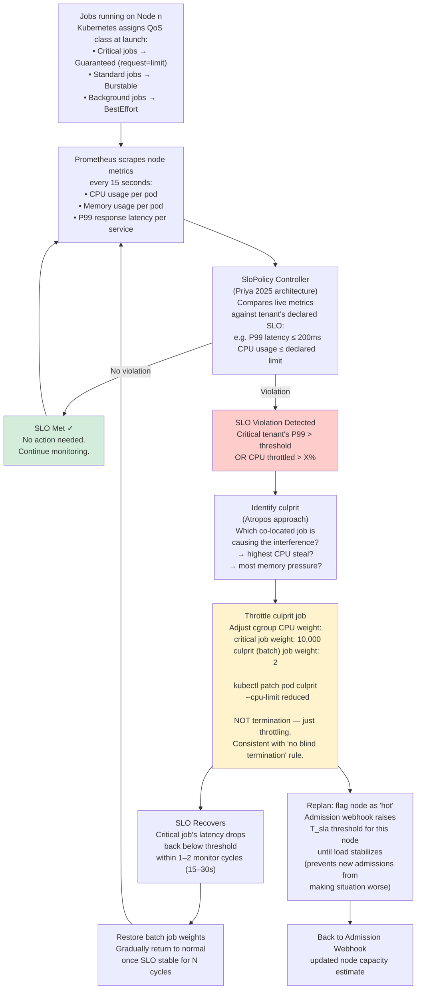
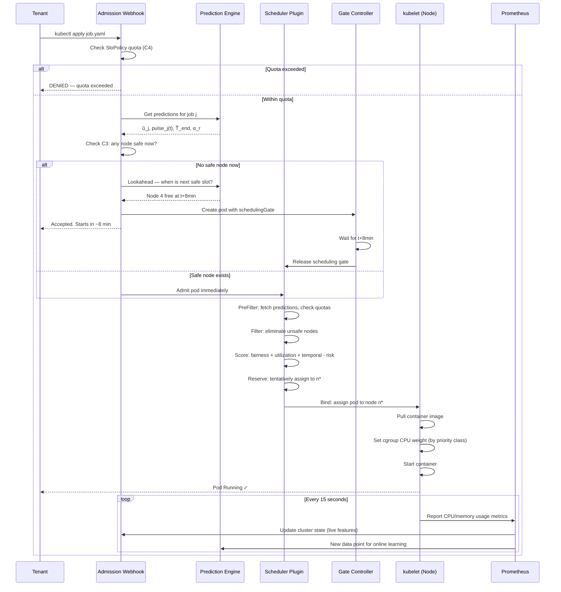

# Multi-Tenant Job Scheduler — Design Diagrams

**Project:** Predictive Multi-Tenant Job Scheduling in Kubernetes  
**Goal:** Maximize cluster utilization while preserving fairness and SLA compliance  
**Core principle:** Prediction is the oracle. Optimization is the decision-maker. Prediction feeds optimization.

---

## Diagram 1 — System Architecture Overview

```
┌─────────────────────────────────────────────────────────────────────────────┐
│                        MULTI-TENANT KUBERNETES CLUSTER                      │
│                                                                             │
│  ┌──────────────┐   ┌──────────────┐   ┌──────────────┐   ┌─────────────┐ │
│  │   Tenant A   │   │   Tenant B   │   │   Tenant C   │   │  Tenant ...  │ │
│  │  (ML Team)   │   │ (Batch ETL)  │   │ (Web APIs)   │   │             │ │
│  └──────┬───────┘   └──────┬───────┘   └──────┬───────┘   └──────┬──────┘ │
│         │                  │                  │                   │        │
│         └──────────────────┴──────────────────┴───────────────────┘        │
│                                    │ Job Submission (resource request YAML) │
│                                    ▼                                        │
│         ┌─────────────────────────────────────────────────────┐            │
│         │              ADMISSION WEBHOOK                       │            │
│         │   (First gate: predict → decide admit/queue/reject)  │            │
│         └───────────────────────┬─────────────────────────────┘            │
│                                 │                                           │
│              ┌──────────────────┼──────────────────┐                       │
│              │                  │                  │                        │
│         ┌────▼────┐      ┌──────▼──────┐    ┌─────▼──────┐                │
│         │ ADMIT   │      │    GATE     │    │   REJECT   │                 │
│         │ (now)   │      │ (schedule   │    │  (queue or │                 │
│         └────┬────┘      │  for T+Δt)  │    │  deny)     │                 │
│              │           └──────┬──────┘    └────────────┘                 │
│              │                  │                                           │
│              └──────────────────┘                                           │
│                        │ Pod released to scheduler                          │
│                        ▼                                                    │
│         ┌─────────────────────────────────────────────────────┐            │
│         │           CUSTOM SCHEDULER PLUGIN                    │            │
│         │  PreFilter → Filter → Score → Reserve → Bind        │            │
│         └───────────────────────┬─────────────────────────────┘            │
│                                 │ Pod assigned to node                      │
│                                 ▼                                           │
│  ┌──────────────────────────────────────────────────────────────────────┐  │
│  │                         WORKER NODES                                 │  │
│  │  ┌──────────┐   ┌──────────┐   ┌──────────┐   ┌──────────┐         │  │
│  │  │  Node 1  │   │  Node 2  │   │  Node 3  │   │  Node N  │         │  │
│  │  │ kubelet  │   │ kubelet  │   │ kubelet  │   │ kubelet  │         │  │
│  │  │ cgroups  │   │ cgroups  │   │ cgroups  │   │ cgroups  │         │  │
│  │  │ [pods]   │   │ [pods]   │   │ [pods]   │   │ [pods]   │         │  │
│  │  └────┬─────┘   └────┬─────┘   └────┬─────┘   └────┬─────┘         │  │
│  └───────┼──────────────┼──────────────┼──────────────┼────────────────┘  │
│          └──────────────┴──────────────┴──────────────┘                    │
│                                 │ Metrics (CPU/mem per pod every 15s)       │
│                                 ▼                                           │
│         ┌─────────────────────────────────────────────────────┐            │
│         │              PROMETHEUS + METRICS STORE              │            │
│         │    Live usage │ Historical traces │ Tenant history   │            │
│         └───────────────────────┬─────────────────────────────┘            │
│                                 │ Training data + live features             │
│                                 ▼                                           │
│         ┌─────────────────────────────────────────────────────┐            │
│         │               PREDICTION ENGINE                      │            │
│         │  Additive Model: cluster + tenant + job-type + now   │            │
│         │  Outputs: predicted P95 usage, duration, peaks       │            │
│         └───────────────────────┬─────────────────────────────┘            │
│                                 │ Predicted values (α, û, T̂_end)           │
│                                 └──► feeds back to Admission + Scheduler    │
└─────────────────────────────────────────────────────────────────────────────┘
```

---

## Diagram 2 — The Optimization Problem (Formal Model)

The scheduler solves this constrained optimization at every job arrival event.

```
╔══════════════════════════════════════════════════════════════════════════╗
║                    OPTIMIZATION PROBLEM FORMULATION                      ║
╠══════════════════════════════════════════════════════════════════════════╣
║                                                                          ║
║  DECISION VARIABLES                                                      ║
║  ─────────────────                                                       ║
║  x_{j,n} ∈ {0,1}     1 if job j is placed on node n, else 0            ║
║  y_j ∈ {0,1}         1 if job j is admitted now, 0 if queued            ║
║  t̂_start(j)          predicted start time for queued job j              ║
║                                                                          ║
║  OBJECTIVE FUNCTION                                                      ║
║  ──────────────────                                                      ║
║  Maximize:                                                               ║
║                                                                          ║
║    U = Σ_j Σ_r  [ y_j × û_{j,r} / C_total(r) ]                        ║
║                                                                          ║
║    where û_{j,r} = PREDICTED actual peak usage of job j for resource r  ║
║          C_total(r) = total cluster capacity for resource r             ║
║                                                                          ║
║  → Maximize the sum of predicted actual utilization across all          ║
║    admitted jobs and all resources (CPU, memory, GPU)                   ║
║                                                                          ║
╠══════════════════════════════════════════════════════════════════════════╣
║                                                                          ║
║  CONSTRAINTS                                                             ║
║  ───────────                                                             ║
║                                                                          ║
║  [C1] CAPACITY (with overcommit):                                        ║
║    Σ_{j: x_{j,n}=1} û_{j,r}  ≤  C_node(n,r) × α_r     ∀ n, r         ║
║                                                                          ║
║    α_r = overcommit ratio for resource r                                ║
║         = min( declared_request / predicted_P95,  α_max )              ║
║         derived from prediction accuracy — higher accuracy → higher α  ║
║                                                                          ║
║  [C2] FAIRNESS (DRF):                                                    ║
║    DS(i) - DS(j)  ≤  ε          ∀ tenants i, j                         ║
║                                                                          ║
║    DS(i) = dominant_share(tenant i)                                     ║
║           = max_r [ Σ_{j∈tenant(i)} û_{j,r} / C_total(r) ]            ║
║    ε = fairness tolerance (tunable, e.g. 0.10 = 10%)                   ║
║                                                                          ║
║  [C3] SLA (predicted utilization stays below threshold):                ║
║    P̂95(n, t)  ≤  T_sla          ∀ n,  t ∈ [now, now + H]              ║
║                                                                          ║
║    P̂95(n, t) = 95th-percentile predicted utilization on node n at t    ║
║    H = lookahead horizon (e.g. 30 minutes)                              ║
║    T_sla = SLA threshold (e.g. 0.90 = 90%)                             ║
║                                                                          ║
║  [C4] PLACEMENT:                                                         ║
║    Σ_n x_{j,n} = y_j            ∀ j   (placed on exactly one node)     ║
║                                                                          ║
║  [C5] TEMPORAL SAFETY:                                                   ║
║    Σ_{j: x_{j,n}=1} pulse_{j,r}(t)  ≤  C_node(n,r) × α_r   ∀ n,r,t  ║
║                                                                          ║
║    pulse_{j,r}(t) = predicted usage of job j for resource r at time t  ║
║    (the additive peaks model — sum of all pulses must stay under cap)   ║
║                                                                          ║
╠══════════════════════════════════════════════════════════════════════════╣
║                                                                          ║
║  WHY IT'S NP-HARD AND HOW WE SOLVE IT                                   ║
║  ─────────────────────────────────────                                   ║
║  This is a variant of multi-dimensional bin packing → NP-hard.         ║
║  We solve it with a GREEDY HEURISTIC using a composite SCORE function.  ║
║  The score is a relaxation of the optimization objective.               ║
║                                                                          ║
║  score(j, n) = w1 × fairness_score(j,n)                                ║
║              + w2 × utilization_score(j,n)                             ║
║              + w3 × temporal_score(j,n)                                ║
║              - w4 × violation_risk(j,n)                                ║
║                                                                          ║
║  Place job j on node n* = argmax_n score(j, n)                         ║
║                                                                          ║
╚══════════════════════════════════════════════════════════════════════════╝
```

---

## Diagram 3 — Optimization Scoring Function (Scheduler Decision)



---

## Diagram 4 — Prediction Architecture: Additive Model

The prediction model decomposes predicted utilization into additive layers. Each layer corrects the one above it.



---

## Diagram 5 — Why Additive Peaks? (Intuition)

```
Predicted cluster utilization on Node 3 over the next 2 hours:

CPU %
100 |
 90 |              ████          ← SLA threshold T_sla = 90%
 80 |         ████████
 70 |    ██████████████████
 60 |████████████████████████
 50 |████████████████████████████████
 40 |
    └──────────────────────────────────► time
      now     +30m    +60m    +90m  +120m

Each running job contributes a "pulse" (its predicted usage shape):

Job A (ML training):  ▁▂▄▆▇████████████▇▅▃▂▁  (slow ramp, plateau, slow release)
Job B (batch ETL):    ████████▁▁▁▁▁▁▁▁▁▁▁▁▁▁  (spike at start, finishes fast)
Job C (web service):  ▄▄▄▄▄▄▄▄▄▄▄▄▄▄▄▄▄▄▄▄▄▄  (steady state)

Sum of pulses = node predicted utilization at each time t
             = pulse_A(t) + pulse_B(t) + pulse_C(t)

New job D wants to run on Node 3. Its pulse:
Job D (batch):        ▁▁▁▁▁▁▁▁████████▁▁▁▁▁▁  (starts in 30 min, peaks at +60m)

Question the optimizer asks:
  ∀ t: pulse_A(t) + pulse_B(t) + pulse_C(t) + pulse_D(t) ≤ T_sla ?

At t=+60m: 40% + 0% + 20% + 35% = 95% > 90%  → UNSAFE → reject this node
At t=+60m on Node 5 (different mix): 25% + 15% + 20% + 35% = 95% → still unsafe
At t=+60m on Node 7: 10% + 0% + 20% + 35% = 65% → SAFE → place here

This is additive peak prediction applied to admission control.
```

---

## Diagram 6 — Prediction Model Training Pipeline (Offline)



---

## Diagram 7 — Admission Control Decision Flow



---

## Diagram 8 — Kubernetes Scheduler Plugin Phases



---

## Diagram 9 — Predictive Future Scheduling (Scheduling Gates)

```
Timeline view: how scheduling gates work

t=0:00  Job D arrives. Prediction: all nodes too hot for next 12 minutes.
        Lookahead: Node 3's Job B finishes at t=0:12. That frees 6 CPUs.
        
        Action: CREATE pod with schedulingGate="wait-slot-node3"
                SET timer: release gate at t=0:12
                NOTIFY tenant: "Job D scheduled to start at 12:00"

                                    gate released here
                                           ↓
t=0:00 ──────────────────────────── t=0:12 ──────────────────── t=0:30
         Pod exists, scheduler              Pod enters scheduler,
         ignores it completely.             immediately placed on
         No retry loop.                     now-free Node 3.
         No wasted CPU cycles.
         No thundering herd.

Comparison:

DEFAULT KUBERNETES             YOUR SCHEDULER (PREDICTIVE GATES)
──────────────────────────     ────────────────────────────────────────
t=0:00  Job D → PENDING        t=0:00  Job D → GATE (release at 0:12)
t=0:15  retry → still pending  t=0:00  Tenant told: starts at 0:12
t=0:30  retry → still pending  t=0:12  Gate released, placed instantly
t=0:45  retry → still pending  t=0:12  Job running ✓
t=1:00  retry → placed (lucky)
        (depends on when scheduler
        happens to check)

Result: faster placement, predictable start times, zero wasted retries.
```

```mermaid
sequenceDiagram
    participant T as Tenant
    participant AW as Admission Webhook
    participant PE as Prediction Engine
    participant GC as Gate Controller
    participant KS as K8s Scheduler
    participant N3 as Node 3

    T->>AW: Submit Job D (4 CPU, 8GB)
    AW->>PE: Predict usage + check all nodes
    PE-->>AW: All nodes at risk for 12min; Node 3 free at t+12m
    AW->>GC: Create pod with schedulingGate, release at t+12m
    AW-->>T: Job accepted. Estimated start: 12 minutes
    
    Note over GC: Timer running. Scheduler ignores gated pod.
    Note over N3: Job B completes at t+12m, frees 6 CPUs
    
    GC->>KS: Remove schedulingGate at t+12m
    KS->>PE: Score nodes for Job D
    PE-->>KS: Node 3 scores highest (just freed, complementary pattern)
    KS->>N3: Bind Job D to Node 3
    N3-->>T: Job D running ✓
```

---

## Diagram 10 — Runtime SLA Enforcement (Prometheus + cgroups)



---

## Diagram 11 — Full End-to-End: Job Submission to Execution



---

## Diagram 12 — How Prediction Feeds Optimization (Variable Mapping)

```
PREDICTION ENGINE OUTPUTS         OPTIMIZATION MODEL USAGE
────────────────────────          ─────────────────────────────────────────

û_{j,r}                    ──►   Objective function: maximize Σ û_{j,r}/C_total
(predicted peak usage)            Constraint C1: Σ û_{j,r} ≤ C_node × α_r
                                  Score: utilization_score = û_j / capacity_left

P̂95(n, t)                  ──►   Constraint C3: P̂95(n,t) ≤ T_sla
(node utilization at t)           Score: violation_risk = P(P̂95 > T | place here)
                                  Gate: admission allowed only if C3 satisfied

pulse_j(t)                 ──►   Constraint C5: Σ pulses ≤ C_node × α_r ∀t
(temporal usage shape)            Score: temporal_score = complementarity(pulse_j, others)
                                  Gate: lookahead uses pulses to find future safe slots

T̂_end(j)                   ──►   Gate timing: release gate at t = T̂_end(running_job)
(predicted job duration)          Queue management: estimate when slots open
                                  Tenant notification: "your job starts in X minutes"

α_r                        ──►   Constraint C1: effective capacity = C_node × α_r
(overcommit ratio)                If prediction accurate → α > 1.0 → more jobs fit
derived from P̂95 vs declared      If prediction uncertain → α = 1.0 → conservative

DS(tenant_i)               ──►   Constraint C2: DS(i) - DS(j) ≤ ε
(dominant resource share)         Score: fairness_score = 1 - DS(i) post-placement
derived from Σ û_{j,r}            Controls scheduling priority among tenants


WITHOUT PREDICTION:               WITH PREDICTION (YOUR SYSTEM):
────────────────────              ─────────────────────────────────────
α_r = 1.0 always                 α_r > 1.0 when model is accurate
Use declared requests             Use predicted actual usage
Conservative → low utilization    Safe overcommit → high utilization
No lookahead                      Predict job end times → gate scheduling
Fairness by count                 Fairness by predicted dominant share
React to SLA violations           Prevent SLA violations before they happen
```

---

## Diagram 13 — Capstone Model Summary

```
┌─────────────────────────────────────────────────────────────────────────┐
│                    YOUR CAPSTONE MODEL AT A GLANCE                      │
├─────────────────────────────────────────────────────────────────────────┤
│                                                                         │
│  INPUT:  Job submission (resource request, tenant ID, priority)         │
│  OUTPUT: Placement decision (node assignment or scheduled future time)  │
│                                                                         │
│  ┌─────────────────────────────────────────────────────────────────┐   │
│  │  PREDICTION LAYER (the oracle)                                  │   │
│  │  What:  Additive model → predicted actual usage per resource    │   │
│  │  How:   Random Forest on Google Cluster Trace                   │   │
│  │  Gives: û_j, pulse_j(t), T̂_end, α_r                           │   │
│  └──────────────────────────┬──────────────────────────────────────┘   │
│                             │ feeds                                     │
│  ┌──────────────────────────▼──────────────────────────────────────┐   │
│  │  OPTIMIZATION LAYER (the decision-maker)                        │   │
│  │  What:  Constrained placement optimization                      │   │
│  │  Obj:   Maximize Σ û_{j,r} / C_total   (utilization)           │   │
│  │  C1:    Σ û_j ≤ C_node × α  (safe overcommit capacity)        │   │
│  │  C2:    DRF fairness: equalize dominant shares                  │   │
│  │  C3:    P̂95(n,t) ≤ T_sla   (SLA safety over time)            │   │
│  │  C5:    Σ pulses ≤ capacity  (no temporal spike overflow)       │   │
│  │  Solve: Greedy heuristic via composite score function           │   │
│  └──────────────────────────┬──────────────────────────────────────┘   │
│                             │ decides                                   │
│  ┌──────────────────────────▼──────────────────────────────────────┐   │
│  │  SCHEDULING LAYER (the executor)                                │   │
│  │  Admit now  → K8s Scheduler Plugin places pod                   │   │
│  │  Gate       → Scheduling gate released at predicted time T*     │   │
│  │  Queue      → Re-evaluated on next job completion event         │   │
│  └──────────────────────────┬──────────────────────────────────────┘   │
│                             │ runs on                                   │
│  ┌──────────────────────────▼──────────────────────────────────────┐   │
│  │  ENFORCEMENT LAYER (the guarantor)                              │   │
│  │  cgroups CPU weights  → protect critical jobs at runtime        │   │
│  │  Prometheus feedback  → detect SLA deviations within 15s       │   │
│  │  SloPolicy controller → throttle culprit, not victim            │   │
│  └─────────────────────────────────────────────────────────────────┘   │
│                                                                         │
│  EVALUATION TARGETS:                                                    │
│  • Utilization ≥ 85%        (vs ~60% default K8s baseline)            │
│  • SLA compliance ≥ 95%     (vs < 80% under load)                     │
│  • Fairness variance < 10%  (DS spread across tenants)                 │
│  • MAPE < 5%                (prediction accuracy)                      │
│  • Queue wait time reduced  (vs default Pending retry loop)            │
│                                                                         │
└─────────────────────────────────────────────────────────────────────────┘
```
