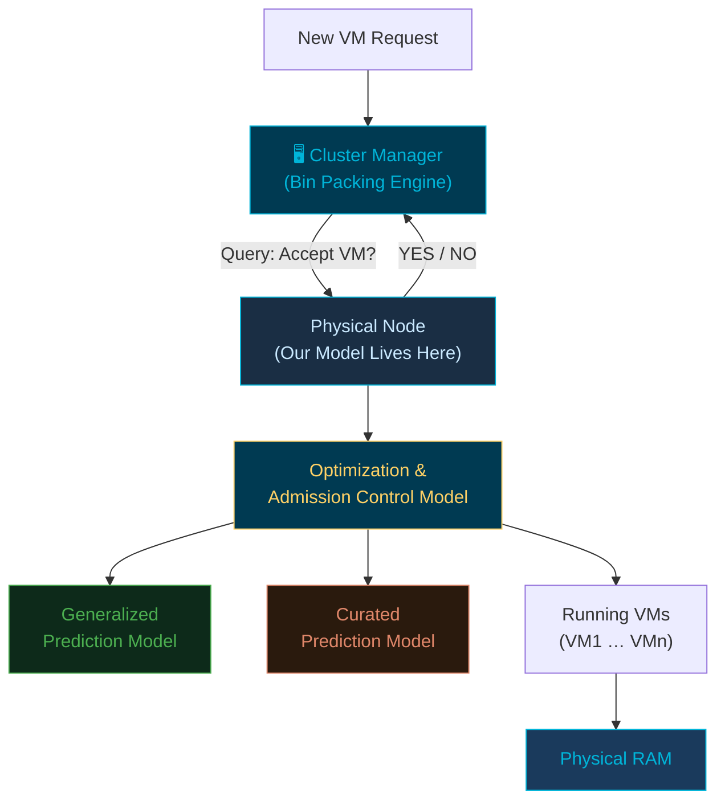
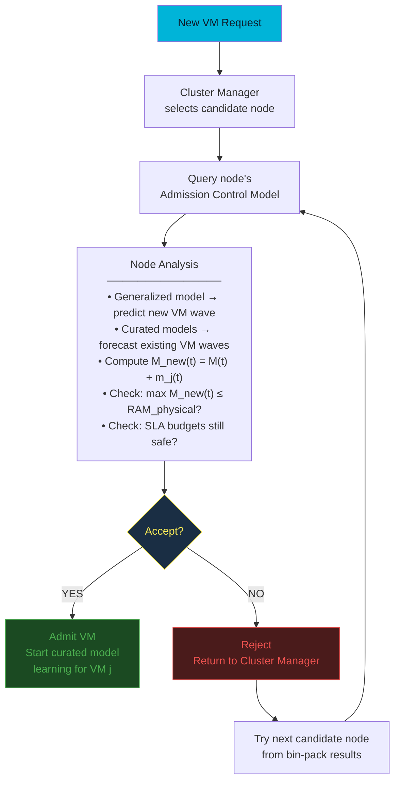
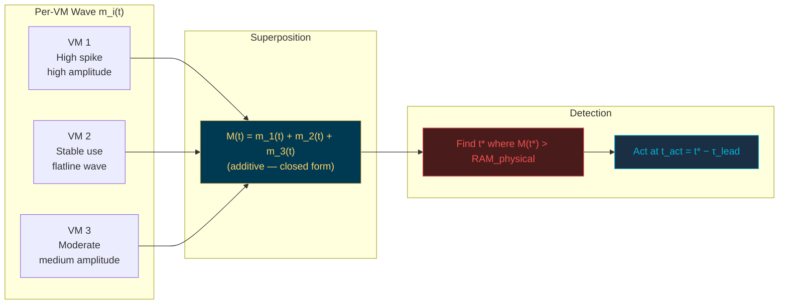
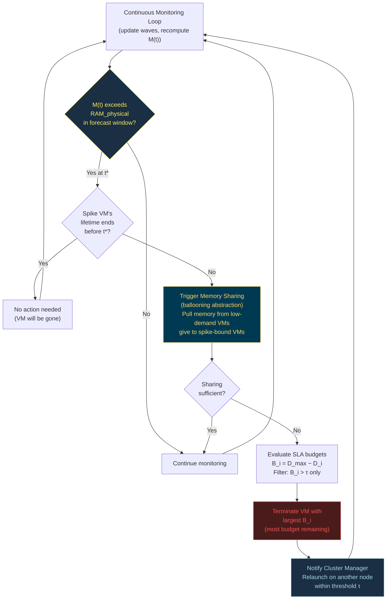
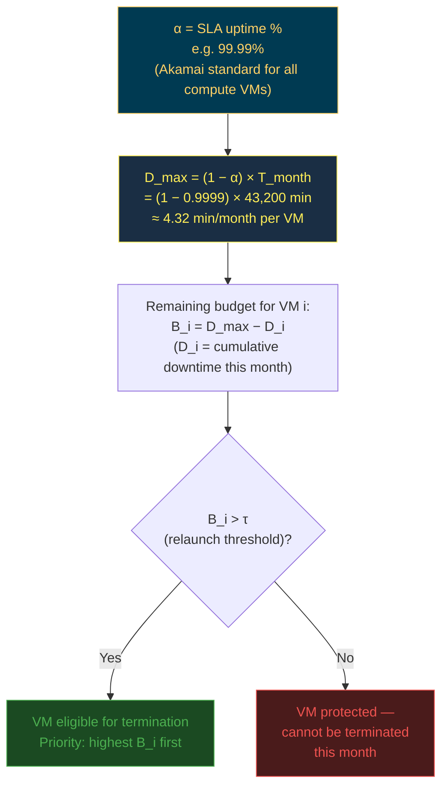
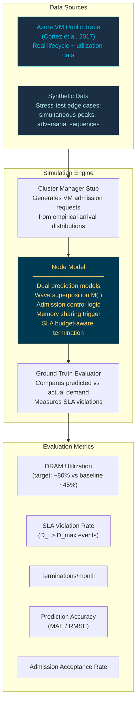

# Project Architecture & Design Diagrams
**Node-Level Predictive Admission Control for Memory Overcommitment**
DAMO 699 Capstone — Spring 2026

---

## 1. System Overview

---

## 2. Admission Control Flow

---

## 3. Wave-Based Memory Demand Model

### Wave Formula

| Symbol | Meaning |
|--------|---------|
| `m_i(t)` | Memory demand of VM i at time t |
| `A_i0` | Baseline (mean) usage — "flatline" component |
| `A_ik` | Amplitude of k-th harmonic — spike height |
| `f_k` | Frequency (e.g., 1/86400 for daily cycle) |
| `φ_ik` | Phase offset — when within period VM peaks |
| `M(t)` | Total node demand = Σ m_i(t) |
| `RAM_physical` | Physical RAM ceiling |
| `t*` | First future time M(t*) > RAM_physical |
| `τ_lead` | Lead time — how far before t* to act |

---

## 4. Continuous Monitoring & Overload Response

---

## 5. Dual Prediction Model — Transition Timeline

```mermaid
gantt
    title Prediction Model Lifecycle per VM
    dateFormat  X
    axisFormat  Day %s

    section Generalized Model
    Active (new VM, no history)          :active, gen, 0, 7
    Blended with curated                 :active, blend, 7, 14

    section Curated Model
    Training begins                      :crit, train, 7, 10
    Blended (increasing weight)          :active, blend2, 10, 14
    Fully active                         :done, cur, 14, 30
```

---

## 6. SLA Downtime Budget Framework

---

## 7. Simulation Architecture

---

## 8. Component Summary

| Component | Role | Simplification Applied |
|-----------|------|----------------------|
| Cluster Manager | Sends VM placement requests to node | Black box — internal bin-packing not modeled |
| Generalized Prediction Model | Forecasts new VM wave using cross-VM trends | Based on VM size/type features (Coach-style) |
| Curated Prediction Model | Learns per-VM wave parameters over time | Transitions from generalized after 7+ days |
| Wave Superposition Engine | Computes M(t) = Σ m_i(t) | Treats each VM as a sinusoidal waveform |
| Admission Control | Checks max M_new(t) ≤ RAM_physical | Binary accept/reject per node |
| Memory Sharing | Redistributes memory before predicted spike | Ballooning abstracted — mechanics not re-derived |
| SLA Budget Tracker | Tracks D_i, enforces B_i > τ for termination | Single α for all VMs (Akamai model) |
| Termination Selector | Picks VM with largest B_i | Whole-VM only — no process-level introspection |
| Cluster Manager Coordinator | Notified to relaunch terminated VM | Fixed relaunch threshold τ assumed |
